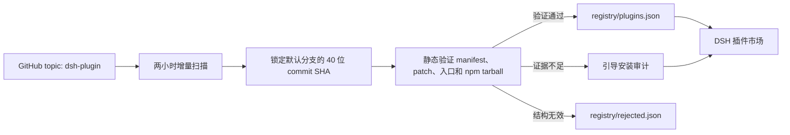

<div align="center">

# DSH Plugin Marketplace

**经过验证的 DSH 插件市场，以及自主维护的中心 Registry。**

[](https://github.com/YELEBAI/dsh-plugin-marketplace/tags)
[](https://github.com/YELEBAI/dsh-plugin-marketplace/actions/workflows/daily-registry-scan.yml)
[](./LICENSE)


**简体中文** · [English](./README.en.md) · [更新日志](./CHANGELOG.md)

</div>

> [!IMPORTANT]
> 市场不会直接展示 GitHub `dsh-plugin` topic 下的所有仓库。只有经过扫描器验证并写入中心 Registry 的插件，才会进入市场。

## 为什么使用它？

| 能力 | 说明 |
| --- | --- |
| 🔍 自动发现 | 每两小时扫描一次 `topic:dsh-plugin archived:false` |
| ✅ Registry 验证 | 检查 manifest、bundle patch、loader entry、运行产物和精确安装来源 |
| ⚡ 一键安装 | 仅对全部自动安装条件均通过的插件开放 |
| 🤖 Agent 安装 | 为需要构建、生命周期脚本或人工判断的插件创建受约束的安装 Agent |
| ⌨️ 手动命令安装 | 安全解析官方 DSH GitHub 安装命令，验证后加入当前 Profile |
| 🧰 安装管理 | 在当前 Profile 中更新、卸载、启用或停用插件，并可安全重启 DSH |
| 📈 插件发现 | 支持分类、搜索、Star 排序和最近 7 天增长趋势 |
| 🔄 市场自更新 | 直接检查本仓库版本，并将更新来源固定到解析后的精确 commit |

## 快速开始

### 1. 安装

```sh
dsh plugin --profile web add github:YELEBAI/dsh-plugin-marketplace#v0.8.0
```

本地开发安装：

```sh
dsh plugin --profile web add D:/path/to/dsh_Market
```

### 2. 启动

```sh
dsh --profile web
```

### 3. 打开市场

进入 **设置 → 插件 → 插件市场**。

市场包含三个子页面：

- **插件市场**：搜索、分类、排序、查看验证信息并安装插件。
- **已安装插件**：过滤、检查更新、更新、卸载、启用或停用当前 Profile 的插件。
- **管理与诊断**：手动命令安装、选择插件安装位置并执行冲突诊断。

## 安装模式

| 模式 | 触发条件 | 市场行为 |
| --- | --- | --- |
| **一键安装** | 精确 GitHub commit 或 npm 版本已通过全部检查 | 直接交给 DSH 官方插件命令安装 |
| **手动命令安装** | 用户提供官方 DSH GitHub 安装命令 | 解析命令、锁定 commit、验证 Bundle 和冲突后安全安装 |
| **Agent 安装** | 需要构建授权、生命周期脚本、额外配置或进一步核验 | 创建绑定 Registry 证据的 DSH Agent 会话 |
| **查看说明** | 当前 Profile 不兼容、身份无法确认或缺少可安全执行的路径 | 不执行命令，只打开作者的安装说明 |

自动安装始终使用 Registry 验证过的精确 GitHub commit 或精确 npm 版本，不会把可变的 `main`、`latest` 或 Release 下载地址直接交给包管理器。

### 手动命令安装

在 **管理与诊断 → 手动命令安装** 中可以粘贴：

```sh
dsh plugin --profile web add github:owner/repo#ref
```

也可以只填写 `github:owner/repo#ref`。输入内容不会交给 Shell；市场只接受当前 Profile 的
单条 GitHub 安装命令，并拒绝额外参数、管道、多命令和危险 ref。tag、分支或省略的 ref
会先解析为精确 commit，随后验证 `package.json`、bundle patch 和冲突。安装过程禁用生命周期
脚本；安装成功后自动加入 Profile 的 bundle 层，并显示在 **已安装插件** 页面。

### 引导安装 Agent

仍处于引导安装的插件会显示 **Agent 安装**；已安装插件存在引导型更新时，会显示 **Agent 更新**。

Agent 任务会固定以下上下文：

- Registry 验证过的仓库、包名、版本和唯一 commit；
- 当前 Profile、bundle patch 和扫描器给出的分类原因；
- README、Issue、脚本和依赖均属于不可信输入的安全边界；
- 安装后复查 Profile 依赖、bundle 层和启用状态的验收要求。

Agent 会先只读检查精确 commit。执行安装、构建、`prepare`、`postinstall` 等第三方代码前，仍由 DSH 原生审批层逐项请求确认，市场不会替用户授权。无法证明安装源、包身份、Profile 兼容性或运行产物时，Agent 会停止并说明缺少的证据。

安装成功后，Agent 的最终答复必须包含 **启动方法**，说明：

1. 应使用哪个 Profile 启动 DSH；
2. 是否需要重启；
3. 插件是否随 DSH 自动加载；
4. 仍需填写哪些配置；
5. Web 入口或实际调用方式。

> [!NOTE]
> 启动 Agent 前至少需要一个工作区。Agent 创建后，关闭设置面板即可查看进度并处理审批。

## 已安装插件管理

| 操作 | 行为 |
| --- | --- |
| 更新 | 根据 Registry 检查新版本；自动与引导更新使用各自的安全流程 |
| 启用 / 停用 | 修改 `dsh.profile.bundles`，不删除依赖，重启后生效 |
| 卸载 | 从当前 Profile 移除插件依赖和对应 bundle |
| 重启 DSH | 等待正在运行的插件任务结束，沿用相同参数和 Profile 重启 |
| 市场自更新 | 直接读取本仓库主分支版本，再将安装来源固定为精确 commit |

npm 包内附带构建后的 `lib/` 和发布时的 Registry 快照。因此远程 Registry 暂时不可用时，市场仍可使用包内快照。

## 安装位置与冲突诊断

默认情况下，插件实体由 pnpm 直接安装在当前 Profile 的 `node_modules` 中，所有 pnpm 任务都复用该 Profile 已绑定的 store，避免出现 `ERR_PNPM_UNEXPECTED_STORE`。

安装位置面板允许把后续安装切换到自定义目录（通过 DSH 的目录选择器）：

- 自定义目录中的插件以 `file:` 依赖关联到 Profile，并把运行入口链接回 Profile 的 `node_modules`；
- 外置插件缺失的 Host peer 依赖（例如 `cordis` → `@deepseek-ai/cordis`）会自动链接；
- 切换目录只影响之后新安装的插件，已有插件保留在原位置并仍可更新或卸载；
- 目录中存在但未关联 Profile 的插件会单独标记，不提供 Profile 操作。

冲突面板对已启用插件做启发式静态诊断：重复的 Bundle ID，以及常见的 Cordis 服务注册形式（`ctx.provide(...)`、`super(ctx, ...)`、`ctx['x'] = ...`、`ctx.x = ...`）。诊断结果是启动崩溃的前置防线，不执行 JavaScript，也可能出现误报（例如入口 bundle 内联了其他插件的代码）；安装、更新或启用前只阻止**新引入**的冲突。

## Registry 如何工作



扫描器不会安装依赖、执行第三方代码，也不会解析 YAML 中的 `!!js` 内容。临时网络失败会保留上一次有效结果，不会导致市场条目批量下架。

### Registry 文件

| 文件 | 用途 |
| --- | --- |
| [`registry/plugins.json`](./registry/plugins.json) | 已验证插件及其安装策略，公开格式为 v2 |
| [`registry/discovery.json`](./registry/discovery.json) | 分类与最近 7 天 Star 增长数据 |
| [`registry/guided-audit.json`](./registry/guided-audit.json) | 所有引导安装条目的逐轮复验结果 |
| [`registry/install-review.json`](./registry/install-review.json) | 安装命令、Profile、生命周期脚本与运行产物证据 |
| [`registry/rejected.json`](./registry/rejected.json) | 未通过结构验证的候选及原因 |
| [`registry/state.json`](./registry/state.json) | 增量扫描状态与每日 Star 基线 |
| [`registry/schema.json`](./registry/schema.json) | 核心 Registry 的 JSON Schema |

未变化且已确认可自动安装的 GitHub 来源会复用上次结果；所有引导条目和 npm 来源每两小时重新核验。某个插件后来发布了合格的 npm 精确版本后，会在下一轮扫描中自动转为一键安装。

## 使用自建 Registry

默认中心 Registry：

```text
https://raw.githubusercontent.com/YELEBAI/dsh-plugin-marketplace/main/registry/plugins.json
```

可以通过环境变量覆盖：

```powershell
$env:DSH_PLUGIN_REGISTRY_URL = 'https://raw.githubusercontent.com/OWNER/REPOSITORY/main/registry/plugins.json'
dsh --profile web
```

也可以在插件配置中设置 `registryUrl`。远程内容默认在内存中缓存 15 分钟并支持 ETag；刷新失败时先使用最近一次有效内容，再回退到包内快照。缓存时间和超时可通过 `registryCacheMinutes`、`registryRequestTimeoutMs` 调整。

自建 Registry 可以不提供 `discovery.json` 和 `guided-audit.json`：

- 缺少 `discovery.json` 时，插件仍可搜索和安装，但分类显示为“其他”，Star 增长为 0；
- 缺少 `guided-audit.json` 时，Agent 仍会依据核心 Registry 的精确 commit 做只读核验，但没有扫描器的辅助审计信息。

## 自动扫描与 PAT

[Registry Scan 工作流](./.github/workflows/daily-registry-scan.yml) 默认每两小时在第 17 分钟执行，也支持在 GitHub Actions 页面手动运行。

扫描优先使用 Actions Secret `REGISTRY_GITHUB_TOKEN` 中的只读 PAT；未配置时回退到仓库自动提供的 `GITHUB_TOKEN`。PAT 只用于读取 GitHub API，不参与 Registry 提交；写回仓库仍使用 Actions checkout 的内置凭据。

在仓库 **Settings → Secrets and variables → Actions** 中添加 `REGISTRY_GITHUB_TOKEN` 即可。不要把 Token 写入工作流、README 或任何提交。

> [!TIP]
> 公开仓库使用标准 GitHub-hosted runner 通常免费；私有仓库会消耗套餐内 Actions 分钟数，超额后计费。详情见 [GitHub Actions billing](https://docs.github.com/en/billing/concepts/product-billing/github-actions)。

首次在本机生成 Registry：

```powershell
corepack enable
pnpm install
$env:GITHUB_TOKEN = gh auth token
pnpm registry:test
pnpm registry:scan
pnpm registry:audit
```

扫描器会自动拆分 GitHub Search 的 1,000 条结果上限，并在配额重置后继续。读取限制为：

- `package.json`：256 KiB
- bundle patch：64 KiB
- npm 压缩包：50 MiB
- npm 解包内容：150 MiB

## 安全与验证规则

候选仓库必须满足以下基础条件：

- `package.json` 是有效 JSON，并包含合法的小写 npm 包名和语义化版本；
- `dsh.bundle.patch` 指向仓库内的安全相对路径；
- 声明 `dsh.client` 时，平台必须是 `web` 且导出 `./client`；
- bundle patch 是有效的 YAML 操作数组；
- patch 至少插入一个 `name` 等于 npm 包名的 loader entry；
- 所有公开字段和精确 commit 均通过 Registry Schema 校验。

<details>
<summary><strong>展开安装分类的完整检查项</strong></summary>

Registry 不会只根据某一个关键词决定能否自动安装，而会交叉检查：

- `package.json` 中的 host/client 入口及可选的 `dsh.marketplace` 声明；
- Git tree 是否确实提交了入口对应的运行产物；
- README 是否给出 `dsh plugin --profile ... add github:...`；
- README 使用旧 owner 或别名时，其 GitHub repository ID 是否与候选仓库一致；
- `<profile>`、`your-profile`、`my-profile` 等占位符不会被误认为真实 Profile；
- 带 Web client 的插件只映射到 `web`；host-only 插件默认支持 `headless` 和 `web`；
- 安装命令可以包含 pnpm 的 `-w` / `--workspace-root`，但必须保留 DSH CLI 所需的 `--profile`；
- `preinstall`、`install`、`postinstall`、`prepare` 生命周期脚本；
- README Profile 与 manifest 声明是否冲突；
- 同名同版本 npm 发行版的 Registry URL、SHA-512 完整性、package identity、bundle patch 和全部运行入口；
- npm 包是否包含 `preinstall` / `install` / `postinstall` 或根级 `binding.gyp`。

GitHub 来源只要包含 `preinstall`、`install`、`postinstall` 或 `prepare`，就始终要求构建授权并保持引导安装；已经提交运行产物也不会取消生命周期脚本的风险提示。精确 npm tarball 不会在作为依赖安装时执行 `prepare`，因此包含完整运行产物且通过静态验证的 npm 版本仍可自动安装。

README 中错误的迁移地址只作为审计信息。如果当前仓库的精确 commit 自身完整且可安装，不会因此被阻断。证据缺失或互相矛盾时，插件保持引导安装，不会靠猜测开放一键安装。

</details>

插件作者可以在 `package.json` 中声明更明确的市场信息：

```json
{
  "dsh": {
    "marketplace": {
      "profiles": ["web"],
      "requiresBuildApproval": false,
      "requiresRestart": true,
      "manualSteps": false
    }
  }
}
```

中心 Registry 也可以通过 [`policy/install-overrides.json`](./policy/install-overrides.json) 为经过人工核对的仓库补充 Profile 或安装信息。

> [!WARNING]
> Registry 验证可以排除错误 topic、普通仓库和结构不完整的伪插件，但不能证明第三方代码绝对安全。插件在 DSH 重启后拥有本机进程权限，安装前仍应确认来源并阅读审批内容。

## 开发

要求：Node.js、pnpm，以及可用的 DSH checkout。构建默认读取 `D:/DSH/deepseek-harness`，也可以通过 `DSH_CHECKOUT` 指定其他位置。

```powershell
pnpm install
pnpm registry:test
pnpm registry:discovery
pnpm discovery:test
pnpm profile:test
pnpm restart:test
pnpm self-update:test
pnpm guided-agent:test
pnpm build
pnpm verify
pnpm exec tsc --noEmit
```

发布前需要更新版本、重新生成 Registry、构建 `lib/`，然后提交产物并创建版本标签。

> [!NOTE]
> 市场 Remote 方法使用 `marketplace/installPlugin`。不要改回 `marketplace/install`：`install` 是 DSH Remote namespace service 的内部生命周期方法名，会与客户端 API 冲突。

## License

[MIT](./LICENSE) © YELEBAI
